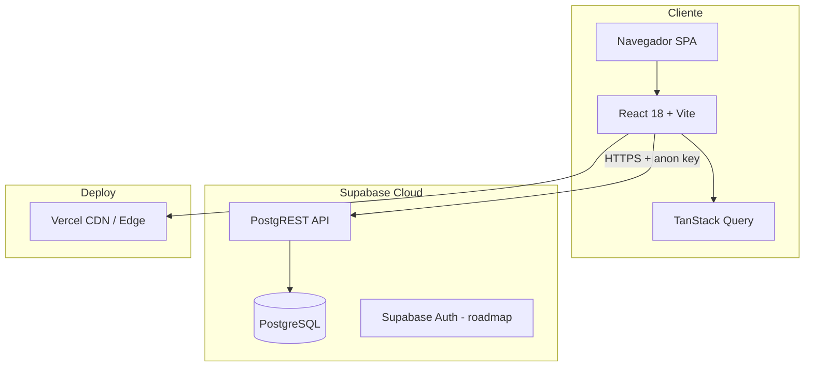

<div align="center">

# Pragma CRM

**CRM modular y escalable para ventas B2B, seguimiento comercial y operaciones de presupuestos.**

[](https://react.dev)
[](https://vitejs.dev)
[](https://supabase.com)
[](https://tailwindcss.com)
[](./LICENSE)
[](https://github.com/GasparQR/emat-crm)

[Demo](#-screenshots--preview) · [Documentación](#-instalación-y-setup) · [Arquitectura](#-arquitectura-del-sistema) · [FAQ técnico](#-preguntas-y-respuestas-técnicas-faq) · [Contacto](#-contacto)

*Implementación de referencia: **EMAT Celulosa** — especialistas en fibra celulosa y aislación.*

</div>

---

## Descripción general

**Pragma CRM** es un sistema de gestión comercial orientado a equipos de ventas que necesitan centralizar **contactos**, **presupuestos**, **pipeline Kanban**, **seguimiento diario** y **reportes** en una sola plataforma web moderna.

### Problema que resuelve

- Dispersión de leads y presupuestos en planillas, WhatsApp y correo.
- Falta de visibilidad del estado comercial (etapas, fechas de cierre, seguimientos vencidos).
- Dificultad para medir conversión por asesor, canal y período.
- Procesos manuales repetitivos (PDF de presupuesto, envíos, backups).

### Para qué tipo de empresas sirve

| Perfil | Ejemplo de uso |
|--------|----------------|
| Ventas técnicas B2B | Industria, construcción, materiales |
| Equipos con asesores | Pipeline por vendedor y metas |
| Operaciones con logística | Rol restringido post-venta (ganados/ejecutados) |
| Pymes en crecimiento | CRM sin complejidad de Salesforce |

### Diferenciales

- **Pipeline visual** con drag & drop y vista móvil optimizada.
- **Presupuestos** con PDF, ítems, IVA y numeración automática.
- **Fecha ganada** (`fecha_ganado`) para métricas de cierre comercial.
- **WhatsApp** integrado (plantillas, listas, historial de envíos).
- **Backup exportable** (contactos + presupuestos en ZIP/CSV).
- **Multi-workspace** preparado en modelo de datos (`workspace_id`).
- **UI premium** con shadcn/ui, responsive y accesible.

### Casos de uso

1. Captar un lead → asignar asesor → cotizar → negociar → marcar **GANADA** con fecha de cierre.
2. Seguimiento diario en **Hoy** (vencidos, próximos 7 días).
3. Reportes ejecutivos por asesor, canal y etapa.
4. Exportar datos del workspace para respaldo o análisis externo.

---

## Características principales

| Módulo | Descripción |
|--------|-------------|
| Dashboard | KPIs, embudo y resumen comercial (`Home`) |
| Pipeline | Kanban por etapas, drag & drop, swipe en móvil |
| Presupuestos | CRUD, filtros, PDF, etapas, fecha ganada |
| Contactos | Base unificada vinculada a consultas |
| Hoy | Agenda de seguimientos del día |
| Reportes | Gráficos, tasas de conversión, pérdidas |
| WhatsApp | Plantillas, variables, listas, historial |
| Configuración | Días hábiles, textos PDF, backup ZIP |
| Roles | `ADMIN`, `ASESOR`, `LOGISTICA` (vistas y rutas filtradas) |
| Llamada rápida | Enlaces `tel:` en móvil |
| Ajustes | Preferencias y acceso a configuración avanzada |

---

## Arquitectura del sistema

Arquitectura **SPA + BaaS**: el frontend React consume **Supabase** (PostgreSQL + API REST/Realtime) sin servidor Node propio en este repositorio.



| Capa | Tecnología | Responsabilidad |
|------|------------|-----------------|
| Presentación | React, Tailwind, shadcn/ui | UI, formularios, Kanban, reportes |
| Estado / datos | TanStack Query, Context API | Cache, workspaces, llamadas activas |
| Acceso a datos | `@supabase/supabase-js` | CRUD sobre tablas `consulta`, `contacto`, etc. |
| Persistencia | PostgreSQL (Supabase) | Datos multi-workspace, triggers (ej. `fecha_ganado`) |
| Auth (actual) | `SimpleAuthContext` + perfil en `usuario` | Roles demo; migración a Supabase Auth planificada |
| Deploy | Vercel | Build estático + variables de entorno |

### Flujo típico: cambio de etapa a GANADA

```
Usuario mueve card en Pipeline
  → buildPipelineStagePatch (cliente)
  → entities.Consulta.update
  → Trigger PostgreSQL set_fecha_ganado
  → fecha_ganado = CURRENT_DATE (si aplica)
```

---

## Stack tecnológico

| Categoría | Tecnología | Versión / notas |
|-----------|------------|-----------------|
| Lenguaje | JavaScript (ESM) | Typecheck vía `jsconfig` + TypeScript tooling |
| Framework UI | React | 18.x |
| Build | Vite | 6.x |
| Routing | React Router | 6.x |
| Estilos | Tailwind CSS | 3.x + `tailwindcss-animate` |
| Componentes | Radix UI + shadcn/ui | Accesibilidad y diseño system |
| Datos remotos | Supabase JS | PostgreSQL managed |
| Estado servidor | TanStack React Query | 5.x |
| Formularios | React Hook Form + Zod | Validación |
| Gráficos | Recharts | Dashboards y reportes |
| DnD Pipeline | @hello-pangea/dnd | Kanban |
| PDF | jsPDF + html2canvas | Presupuestos |
| Export backup | JSZip + PapaParse | CSV UTF-8 en ZIP |
| Fechas | moment, date-fns | UI y reglas de negocio |
| Pagos (deps) | Stripe React SDK | Integración enterprise opcional |
| Lint | ESLint 9 | `npm run lint` |
| Hosting | Vercel | CI/CD desde GitHub |

---

## Instalación y setup

### Requisitos

| Herramienta | Versión mínima |
|-------------|----------------|
| Node.js | 18+ (recomendado 20 LTS) |
| npm | 9+ |
| Cuenta Supabase | Proyecto con tablas del CRM |
| Git | 2.x |

Opcional: Supabase CLI para migraciones locales.

### Variables de entorno

Copiá el ejemplo y completá con tu proyecto:

```bash
cp .env.example .env.local
```

```env
# URL pública de la app (desarrollo o producción)
VITE_APP_BASE_URL=http://localhost:5173

# Clave anónima de Supabase (Settings → API)
# NUNCA commitear la service_role en el frontend
VITE_SUPABASE_ANON_KEY=your_supabase_anon_key_here
```

> El cliente Supabase está configurado en [`src/api/supabaseClient.js`](src/api/supabaseClient.js). Sin `VITE_SUPABASE_ANON_KEY` la app muestra error en consola y el acceso a datos falla.

### Instalación

```bash
git clone https://github.com/GasparQR/emat-crm.git
cd emat-crm
npm install
npm run dev
```

Abrí **http://localhost:5173**

### Migraciones de base de datos

Las migraciones SQL viven en [`supabase/migrations/`](supabase/migrations/).

Ejemplo — columna y triggers de **fecha ganada**:

```bash
# Con Supabase CLI (si está vinculado el proyecto)
supabase db push

# O ejecutar manualmente en SQL Editor del dashboard:
# supabase/migrations/20260521120000_add_fecha_ganado_to_consulta.sql
```

Esquema adicional de referencia: [`supabase/schema_plantillas.sql`](supabase/schema_plantillas.sql).

### Seed de datos

No hay seed automático en CI. Los datos iniciales pueden cargarse desde:

- Registros existentes en Supabase del workspace.
- Módulo legacy [`src/lib/celulosaData.js`](src/lib/celulosaData.js) (demo local, según entorno).

### Build de producción

```bash
npm run build
npm run preview   # vista previa local del build
```

Artefacto en `dist/`, listo para Vercel u otro host estático.

### Deploy (Vercel)

1. Importar repositorio en [vercel.com/new](https://vercel.com/new).
2. Framework preset: **Vite**.
3. Variables de entorno: `VITE_SUPABASE_ANON_KEY`, `VITE_APP_BASE_URL`.
4. Deploy en cada push a `main` o `Develop` (según tu flujo).

```bash
# Build command (default)
npm run build

# Output directory
dist
```

---

## Estructura del proyecto

```text
emat-crm/
├── public/                 # Assets estáticos
├── src/
│   ├── api/
│   │   └── supabaseClient.js   # Cliente Supabase, entidades, auth
│   ├── components/
│   │   ├── crm/               # Dominio: cards, forms, WhatsApp, PDF
│   │   ├── context/            # Workspace, llamada activa
│   │   ├── hooks/              # useCurrentUser, use-mobile
│   │   └── ui/                 # Design system (shadcn)
│   ├── lib/
│   │   ├── pipelineStage.js    # Lógica etapas / fecha_ganado
│   │   ├── backupExport.js     # Backup ZIP contactos + presupuestos
│   │   ├── consultaPdf.js      # Generación PDF
│   │   └── ...
│   ├── pages/                  # Rutas: Home, Pipeline, Consultas, etc.
│   ├── utils/                  # Helpers de dominio
│   ├── Layout.jsx              # Shell, navegación, roles
│   ├── App.jsx
│   └── pages.config.js         # Registro de páginas
├── supabase/
│   ├── migrations/             # Migraciones versionadas
│   └── schema_plantillas.sql
├── .env.example
├── package.json
└── vite.config.js
```

| Carpeta | Responsabilidad |
|---------|-----------------|
| `src/pages/` | Vistas de negocio por módulo |
| `src/components/crm/` | Componentes reutilizables del CRM |
| `src/api/` | Capa de acceso a datos (único punto Supabase) |
| `src/lib/` | Lógica pura: export, PDF, teléfono, etapas |
| `supabase/` | DDL, triggers y evolución del esquema |

---

## Seguridad

| Aspecto | Estado actual | Recomendación producción |
|---------|---------------|---------------------------|
| Autenticación | **Supabase Auth** (solo login; sin registro público) | Desactivar sign up en Providers → Email; ver `scripts/setup-auth-user.md` |
| Autorización | Roles `ADMIN` / `ASESOR` / `LOGISTICA` + guards de ruta | **RLS** aplicado en `usuario`, `asesor`, `consulta`, `contacto` |
| API keys | Solo `anon` en frontend | Nunca exponer `service_role` |
| Datos por tenant | `workspace_id` en entidades | Políticas RLS por `workspace_id` |
| Validación | Zod + reglas en formularios | Validar también en DB (constraints) |
| HTTPS | Vercel / Supabase por defecto | Obligatorio en producción |
| Backups | Export manual ZIP en Configuración | Backups automáticos Supabase + retención |
| Alta de usuarios | Panel Supabase o Edge Functions `admin-*` | Sin `signUp` en la app; signup deshabilitado en Auth |

Buenas prácticas ya consideradas en el código:

- Paginación interna en `SupabaseDataStore.filter` (chunks de 1000 filas).
- Fallback de columnas en formularios si el esquema aún no migró.
- Triggers de negocio en servidor (`fecha_ganado`) para evitar inconsistencias.

---

## Escalabilidad

- **Modularidad por páginas y componentes CRM** — nuevos módulos sin reescribir el core.
- **Multi-workspace** — modelo listo para multi-empresa con `workspace_id`.
- **Paginación de lecturas** — consultas grandes no cargan todo en una sola request.
- **React Query** — invalidación selectiva por módulo (`consultas-pipeline`, `contactos`, etc.).
- **Horizontal (frontend)** — SPA estática; escala en CDN (Vercel).
- **Horizontal (datos)** — Supabase/Postgres escala vertical y con réplicas según plan.
- **Roadmap**: colas para envíos masivos WhatsApp, cache edge, multi-tenant estricto con RLS.

---

## Performance

| Área | Implementación |
|------|----------------|
| Bundle | Vite code-splitting por rutas |
| UI móvil | Listas compactas, pipeline colapsable, menos DOM |
| Datos | React Query cache + límites configurables en `filter()` |
| Consultas DB | Índices recomendados en `workspace_id`, `pipeline_stage`, `fecha_ganado` |
| PDF / export | Operaciones bajo demanda (no en carga inicial) |
| CDN | Assets estáticos en Vercel Edge |

---

## Integraciones

| Integración | Estado | Ubicación |
|-------------|--------|-----------|
| Supabase (DB + API) | Activo | `src/api/supabaseClient.js` |
| WhatsApp (plantillas / envíos) | Activo | `WhatsAppSender`, `Plantillas`, `ListasWhatsApp` |
| PDF presupuestos | Activo | `src/lib/consultaPdf.js` |
| Llamadas (`tel:`) | Activo (móvil) | `QuickCallButton`, `FloatingCallButton` |
| Stripe | Dependencias presentes | Roadmap facturación |
| Excel (xlsx) | Librería disponible | Export legacy / futuro |
| Webhooks | Roadmap | Automatizaciones enterprise |
| Email / ERP | Roadmap | Según cliente |

---

## Roadmap

- [x] Supabase Auth + administración de usuarios por Edge Functions
- [x] RLS por rol (`ADMIN`/`ASESOR`/`LOGISTICA`) en tablas críticas
- [ ] API REST documentada (OpenAPI) para integraciones
- [ ] Webhooks salientes (etapa ganada, nuevo lead)
- [ ] App móvil nativa o PWA offline
- [ ] Analytics avanzado y cohortes por `fecha_ganado`
- [ ] IA: scoring de leads y sugerencia de seguimiento
- [ ] Multi-tenant SaaS con billing (Stripe)
- [ ] Importación masiva CSV / sincronización ERP

---

## Preguntas y respuestas técnicas (FAQ)

### Arquitectura

**¿Qué arquitectura utiliza el sistema?**  
SPA React desacoplada que consume Supabase (PostgreSQL + PostgREST). La lógica de negocio crítica puede vivir en triggers SQL y, progresivamente, en Edge Functions.

**¿Es monolítico o modular?**  
Modular en el frontend (páginas + `components/crm` + `lib`). Un solo repositorio; el backend managed es Supabase.

**¿Está preparado para microservicios?**  
El dominio puede extraerse por bounded contexts (ventas, mensajería, reportes). Hoy la prioridad es simplicidad operativa; microservicios serían fase enterprise.

**¿Permite multi tenant?**  
Sí a nivel de datos mediante `workspace_id`. Falta endurecer aislamiento con RLS y auth por organización para SaaS multi-cliente.

---

### Escalabilidad

**¿Cuántos usuarios concurrentes soporta?**  
Depende del plan Supabase y de Vercel. Una SPA estática escala bien en CDN; el cuello de botella suele ser Postgres (conexiones y queries). Con índices y paginación, equipos comerciales de decenas a cientos de usuarios son viables en planes estándar.

**¿Cómo escala el sistema?**  
Frontend: más instancias CDN. Datos: upgrade Supabase, índices, read replicas. Código: límites en `filter()` y cache React Query.

**¿Está optimizado para grandes volúmenes de datos?**  
Lecturas paginadas (1000 filas por página). Export backup sin tope artificial en presupuestos/contactos. Para millones de filas se recomienda reporting externo (warehouse) o vistas materializadas.

---

### Seguridad

**¿Cómo se manejan autenticación y permisos?**  
Hoy: roles en cliente (`admin`, `logistica`) y filtrado de vistas. Producción: Supabase Auth + JWT + RLS por rol y workspace.

**¿Los datos están cifrados?**  
En tránsito (TLS). En reposo: cifrado gestionado por Supabase/AWS según su documentación.

**¿Cumple buenas prácticas de seguridad?**  
Base sólida; se requiere RLS, rotación de keys y auth real antes de datos sensibles en producción multi-cliente.

---

### Infraestructura

**¿Dónde puede desplegarse?**  
Vercel, Netlify, Cloudflare Pages o cualquier host de archivos estáticos + variables `VITE_*`.

**¿Soporta Docker?**  
No incluido en el repo; se puede empaquetar el build `dist/` con nginx en minutos.

**¿Puede instalarse on-premise?**  
Sí: build estático self-hosted + Postgres propio (requiere adaptar `supabaseClient` o usar PostgREST self-hosted).

**¿Funciona en AWS / VPS / Cloud?**  
Sí. Patrón recomendado: S3 + CloudFront (o VPS con nginx) + Supabase Cloud o RDS PostgreSQL.

---

### Desarrollo

**¿Es posible agregar módulos personalizados?**  
Sí. Registrar página en `pages.config.js`, componentes en `components/crm/`, entidad en `entities` si hay tabla nueva.

**¿Tiene API REST?**  
Acceso vía API auto-generada de Supabase (PostgREST). API pública documentada propia: roadmap.

**¿Posee documentación técnica?**  
Este README, migraciones SQL y código tipado en convenciones del repo. Se recomienda ampliar `/docs` con ADRs.

**¿Cómo se gestionan migraciones?**  
Archivos SQL en `supabase/migrations/`, aplicados con Supabase CLI o SQL Editor.

---

### Integraciones

**¿Puede conectarse con APIs externas?**  
Sí desde el cliente (fetch) o futuras Edge Functions en Supabase para secretos.

**¿Tiene soporte para webhooks?**  
Roadmap. Hoy se puede disparar lógica en triggers DB o funciones serverless externas vía cron.

**¿Se integra con WhatsApp?**  
Flujo de plantillas, variables y registro de envíos en el CRM. Integración API oficial de WhatsApp Business según contratación del cliente.

---

### Negocio

**¿El sistema puede adaptarse a distintos rubros?**  
Sí. Etapas de pipeline, campos de consulta y reportes son configurables por implementación.

**¿Es white-label?**  
Personalizable (marca, colores, copy). White-label completo es servicio de implementación Pragma.

**¿Puede personalizarse completamente?**  
Sí — es software a medida. El repositorio EMAT es una instancia de referencia.

**¿Cómo es el proceso de implementación?**  
Discovery → esquema y roles → migración de datos → capacitación → deploy → soporte. Contacto comercial al final de este documento.

---

### Performance

**¿Qué medidas de optimización tiene?**  
React Query, paginación Supabase, UI responsive, generación PDF/export bajo demanda, build Vite optimizado.

**¿Cómo se manejan consultas pesadas?**  
Filtros en cliente sobre datasets acotados por workspace; para analytics pesados, export CSV o BI externo.

---

### Mantenimiento

**¿Cómo se actualiza el sistema?**  
Git flow: ramas feature → `Develop` → `main`. Deploy automático en Vercel. Migraciones SQL versionadas.

**¿Posee logs y monitoreo?**  
Logs de navegador y Supabase Dashboard. Producción: Vercel Analytics, Sentry (recomendado), logs Postgres.

---

## Screenshots / Preview

> Agregá capturas en `/docs/screenshots/` y descomentá las líneas siguientes.

```markdown


```

---

## Contribución

### Git flow sugerido

```text
main / Develop     → ramas estables
feature/*          → nueva funcionalidad
fix/*              → correcciones
CAMBIOS-ETAPA-*    → entregas por fase (ejemplo actual)
```

### Pull requests

1. Fork o rama desde `Develop`.
2. `npm run lint` y `npm run build` sin errores.
3. PR con descripción, capturas si hay UI, y nota de migraciones SQL si aplica.
4. Revisión de código antes de merge.

### Convenciones

- Componentes CRM en `src/components/crm/`.
- Lógica de dominio reutilizable en `src/lib/`.
- Nombres de columnas DB en **snake_case** en payloads (`fecha_ganado`, `pipeline_stage`).
- Commits en español o inglés, imperativo y descriptivos.

---

## Licencia

Este proyecto es **software propietario** desarrollado por **Pragma / GasparQR**.

No está licenciado para redistribución sin autorización escrita. Contactá para licenciamiento, implementación white-label o soporte enterprise.

---

## Contacto

| Canal | Enlace |
|-------|--------|
| Repositorio | [github.com/GasparQR/emat-crm](https://github.com/GasparQR/emat-crm) |
| Demo | _Solicitar acceso a entorno de demostración_ |
| Implementación / CRM a medida | _Contacto comercial Pragma_ |
| Email | pragmasolucionesdigitales@gmail.com |
| LinkedIn | _Perfil del equipo Pragma_ |

---

<div align="center">

**Pragma CRM** — Ventas claras, datos confiables, crecimiento medible.

*Documentación generada para onboarding técnico y presentación comercial.*

</div>
